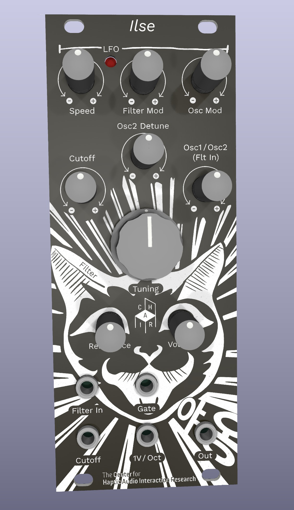

# ILSE. An Analog Monophonic Synthesizer Module for Education

Ilse is designed as a low cost, easy to build, but still flexible and feature rich synthesizer. 
It is based on Syntherjacks single-chip synthesizer [Totoro](https://syntherjack.net/totoro-1-ic-simple-synth/) and extends the design for voltage control on filter, oscillators and LFO.

Components: 

- two saw tooth oscillators
- brigded-T low pass filter with resonance switch 
- triangle LFO with speed control, and routing to filter or oscillators
- simple mixer and detune for oscillators
- level control
- external filter input

Modulation Inputs: 

- 1V/Oct input for oscillators
- Gate
- Filter Cutoff (exponential)
- LFO Speed (linear, via pin header)
- Oscillator 2 detune (linear, via pin header)

You might as well just examine the schematics in the simulator and  build your own synthesizer from it. It uses a neat trick to build the  exponential converters directly into the saw tooth oscillators as you  can see from the simulation below. Note that the tuning of the  oscillators is not temperature compensated and will thus change with  room temperature. We would not recommend using Ilse in a stage situation where reliable and exact pitches are important.

[Saw Tooth Oscillators](http://www.falstad.com/circuit/circuitjs.html?ctz=CQAgjCAMB0l3AmAHAZgCxoGwHYwMmEmGpJuGLEjggrggKwCcRCZWI9IaKHApgLRgwAKAAeIfkkgSEKJBzQyUnRYRABlAIYB3ADoBnAOK8AdrwBOmgC4B7c8M0ySUCXnnT5YToM5h48F34EaCQaTHp6BDRQxjcUbHB-SGEAc3AyFAR0kExFaWT8BLdssGwyMDYQGwBXKwAHWuEAY2z+XPBkCXbpMAF5QWhMJGwmOXpIcZQ8ejIYOBFzJ2lopY73RP9hRaDnFcFOlelaTe1VitWVhGFT-fXbrncHEvLO889vLw3-CTn4CuH6GVGNg0NgUODsKEXH4Tq12ud8tc1l1VK9ZkjiudMZ1kqdsf0oj0calVoIyEEkP0EVAxDIIJIEowJEhFIp5FZzABLTQmFIAG14tLJEgwrhFEDZIH0Oi2IqpnTJ0nuPTgwgQQmRxUJyOkKjQMPAQrKMnwIEYWSCpS4HRA2mgBl4ojqNjMJis3L5BgAZuZeABHaqmJoATwMTQAbsIrHLXArDoEIMRoNFQmBGPqvChgZSftB6HhIGgmJhMl4EIwsxsQAATXhezTVPlWJH8TLQ2Y0m7dWPrZKOILYC3FRU9kDvVy+JL5WD+fPqyBRZSyEuDhIq2EDofmmSD1yi5JpTeuPA7i1SFzJba0LcWpeubfr+DCABKEjvgm3-H15LTWXyXCVCB-xgehhFKRR+DnY8LSwCDSnKDgAhgEgIAAMV9P0QAAeS9L19F4ZtX0gk8diVKCj3-ZxPmAvNZS-OA9wg69GJcfAn22CpAM-TjRx6cZknA097yHY0giicBEOnQFt3UJpND5TleRbGgmPEkcxLyFseI01xMC4v8tL04TXFE39O10wCFW0xh0W2cihAtcj4341UiKc-ooOAgCJwvKBaLskjtWIkSOxhVVxC-cE6R4VsqDpZZwFUAA1AB6LCmmbG4SEA0Uv3aQR9yFUEmUET56JihzrWIEB0P9AwcLwgjhBsEAeGpfMUBVPygJALIeBQYQ5F6tc31akAkpsJtNBSQUgA)

It features a simple voltage controllable low pass filter that you can modulate with the inbuilt LFO or an external source.

[Voltage Controlled Filter](http://www.falstad.com/circuit/circuitjs.html?ctz=CQAgjCAMB0l5YCsA2ATIkrkGZbIBzJgCckqxxY2yI2kIGALNgwKYC0YYAUAB4jt8hAYlEDsAdnrtRqEI1pyAagHsANgBcAhgHNWAHQDOAYRUA7DQCd1a1gBMjAIUsBLO3oeGAKkYBiLzVZLblQucUQ5TkYFdlQhATBoqFoQfHhwPhEUcJE4cTkFVAV-QOCAJQFiJNjGaSqY1Eh8ZPpaypaoaERuMAkY+vFqAXxiGljsiDB4PJgJZAk6aaWEEGMAVw0VADMt7kth5Bjo5vYJCIFj5Kn4bgB3ETiLvJlH9kYwGkg7kTBI2ulEL9xPgFF97i8Tv8fn8Zt8ZNUoRCnvQwSJqtgQWijrDwYh0UN4TFsOdUUj2NgCXiiUNSYDIhSxnTwnJaa8GdDBp89hzyZiZEDySTwEtuBUyezxZBQck2uxiB0YN0NCI5uICFi1c1Jp1EAsqoh9ZBiKhGmJFQsRmdsMQ6FRdfLriA7Kwtlo1po4Zc3h8LowTqgJCzuABjB6Qn1vP0XH30VDQRrLROoDgnYjQIQGkhESBoRJm2AIEMCZBNaOM17vT6YeOJpMp1LQCgURgB7CMCIjeIwOA8cEl-2B4ul71c8FegN-KOxIpQOH9gQTof+mdffanKUJEtLzco4XTbg6becV7zuVVr6NCS+gcw6SLhQqDYABw23C0R8SRynn9SIHlcr3aYBG7aYM1GNIPneVA6EeehrhuPthxNGJTw+FFPSnZDrwSJIvjFAZyQJAiMWlVp6HlXdFW5SMTh-QVIh-OD9zXYkGPRc52EOK4bkPejiyJDio3Q8FCAEyJRIXLs4Qk2J4kEUZJOaPCBCkGI0JU9VOC3VpUjghUumo09FxohdByY-d8Irb84EhITwHsq9KIM-hOC4CBIwYnNIWteRMAUAAZXwAHlqJk1iVI48LzLgOEzknE44s1WdwUS8lNN1MZqCU2LIo41KstnUM5Ssk4ZMuFEC3gJtqpq6qQGQaBGDOaJAwxIR5mwFkCx4IqjJnflIiwuCOH-GAwIkEFEE6vFoLIToe2oplpy-ZdpSmTJXKQUz-2IfAWFiVVCmKAINCCIx1k2HYNuNdzEn-fAtqiGgjpAILDGDAI1C0TZghUTBnplKYaAwGAIFjf7aG4IA)

Ilse was designed for educational use and was used in an introduction to electronics course. For more details on the schematics see the [course material](https://www.uni-weimar.de/kunst-und-gestaltung/wiki/IFD:Analog_Circuits_and_Interfaces_WS20_21/introduction_to_electronics).

Here you can find the [schematic](ilse.pdf) and [build instructions](https://discourse.chair.audio/t/ilse-build-instructions).  

